# API Testing with JMeter — ServeRest


Automated API test project built with **Apache JMeter**, using the open source public API **[ServeRest](https://serverest.dev/)** as the target. The goal of this project is to build a functional test plan with multiple requests, validate REST API behavior, and analyze performance metrics under different load conditions (1, 50, and 100 concurrent users).

## 🔑 Key Findings

- The API handled **50 concurrent users with 0% errors**.
- At **100 concurrent users, error rates rose to 22–29% across all endpoints** — including read-only ones, suggesting the API starts rejecting requests under high load rather than just responding slower.
- Response times stayed relatively contained even at 100 users (well under 1 second on average), pointing more toward rate-limiting/connection rejection than server overload from slow processing.

## 🎯 Objective

Validate the behavior of REST API endpoints (user creation, user listing, user lookup by ID, and product listing), checking HTTP status codes, response times, and response integrity — and compare how the API performs across three concurrency levels: 1, 50, and 100 users.

## 🛠️ Tools Used

- **Apache JMeter** — performance testing and request automation tool
- **ServeRest API** — public API for testing practice (`https://serverest.dev`)
- **JSON** — format used in the request bodies

## 🧩 Test Plan Structure

The test plan was built using the following JMeter elements:

### Thread Group
The starting element of the plan, responsible for defining the number of users (threads) that run the test, the ramp-up time, and the number of loops. This project uses **three separate Thread Groups** — 1 user, 50 users, and 100 users — kept in the same test plan but enabled one at a time, so each scenario could be executed and measured in isolation.

### HTTP Requests
Four separate HTTP Request samplers were added inside each Thread Group, each targeting a different endpoint of the ServeRest API:

| Sampler Name | Method | Endpoint |
|---|---|---|
| **Login - new user** | POST | `https://serverest.dev/usuarios` |
| **Login - get user** | GET | `https://serverest.dev/usuarios` |
| **Login - user/id** | GET | `https://serverest.dev/usuarios/${USER_ID}` |
| **Product** | GET | `https://serverest.dev/produtos` |

Keeping all requests inside the same test plan (instead of overwriting a single HTTP Request each time) allows the whole flow to run together and produces a single, consolidated Summary Report per scenario.

### HTTP Header Manager
Used to manage request headers, ensuring the `Content-Type` and other headers were correctly set for sending JSON data.

### User Defined Variables
Reusable variables were defined for data that stays constant across all test users:
- `USER_PASS` — fixed password (`test123`), reused by every created user
- `USER_ADMIN` — fixed administrator flag (`true`)

Name and email are generated dynamically per request (see Test 1 below), so each thread creates its own unique user.

### JSON Extractor
Added as a **Post Processor** on the "Login - new user" request. It reads the `_id` field from the user-creation response and stores it in a variable (`USER_ID`), scoped to that specific thread/iteration. This is what allows "Login - user/id" to automatically look up the user that was just created in that same iteration, without any manual ID handling.

- **Names of created variables:** `USER_ID`
- **JSON Path expressions:** `$._id`
- **Match No.:** `1`
- **Default Value:** `ID_NAO_ENCONTRADO` (makes it obvious in the results if extraction ever fails)

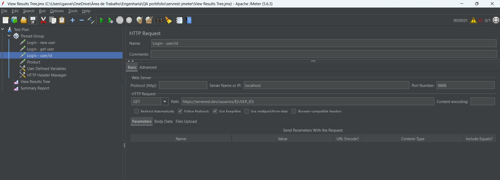
*JSON Extractor added under "Login - new user", capturing `_id` from the response into the `USER_ID` variable for that thread.*

### View Results Tree
Component used to visualize the detailed result of each request (request/response), including status code, response body, and headers.

### Summary Report
Provides a consolidated view of request performance, including average response time, throughput, and error rate for the tested API — used here to compare the 1, 50, and 100-user scenarios.

---

## ✅ Test Cases

### Test 1 — Create User

**Method:** `POST`
**Endpoint:** `https://serverest.dev/usuarios`

**Description:**
Request to register a new user. The body uses JMeter's `${__UUID()}` function to generate a unique name and email on every execution, so the same request can be run any number of times — across 1, 50, or 100 threads — with each one creating its own distinct user.

**Body Data (JSON):**
```json
{
  "nome": "Gislaine ${__UUID()}",
  "email": "gislaine_${__UUID()}@qa.com.br",
  "password": "${USER_PASS}",
  "administrador": "${USER_ADMIN}"
}
```

**Steps performed:**
1. Configured the endpoint, POST method, and the JSON body above.
2. Sent the request and checked the actual Request body that was submitted, to confirm the UUID was substituted correctly.
3. Ran the test and reviewed the result in the View Results Tree tab.

**Result:**
Request executed successfully — status code **201 (Created)**, with the message `"Cadastro realizado com sucesso"` (registration successful) returned by the API, along with the new user's `_id`, which the JSON Extractor immediately captures for later use.

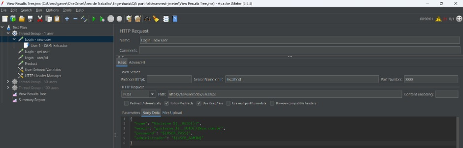
*HTTP Request configuration: POST method, endpoint `https://serverest.dev/usuarios`, and JSON body using `${__UUID()}` and the `USER_PASS`/`USER_ADMIN` variables.*

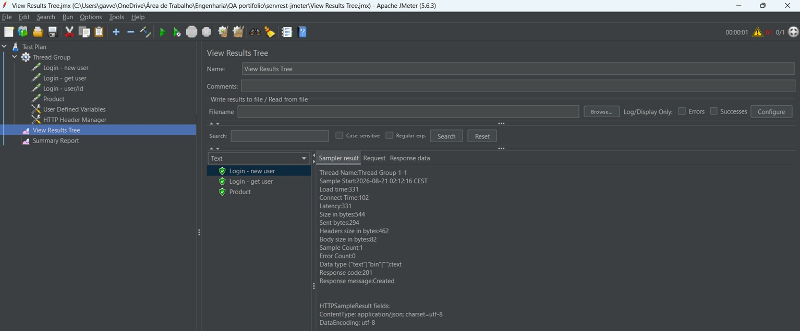
*Sampler result showing response code 201 and message "Created", along with load time and byte size details.*

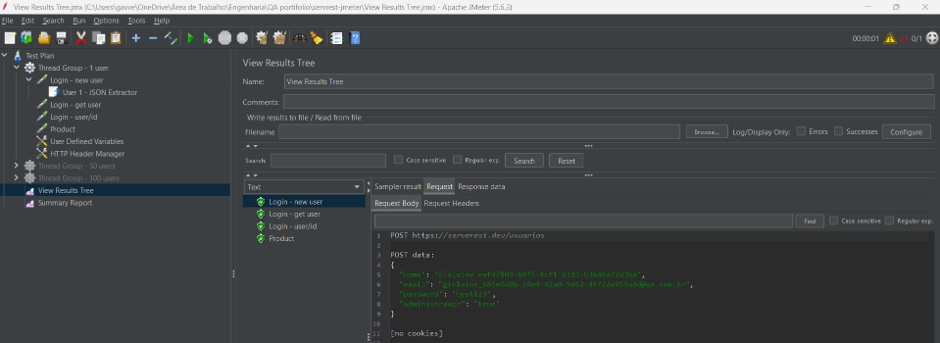
*Detail of the actual request body sent, with the UUID already substituted into the name and email fields.*

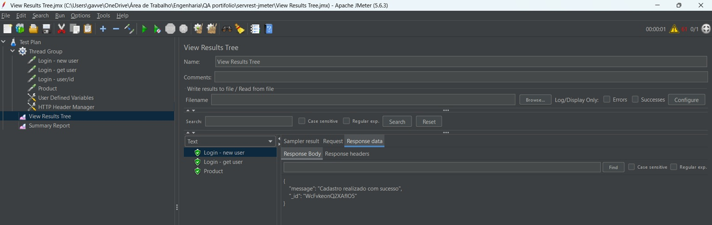
*API response confirming the user registration with the success message and the returned `_id`.*

---

### Test 2 — List Registered Users

**Method:** `GET`
**Endpoint:** `https://serverest.dev/usuarios`

**Description:**
A simple request, containing only the endpoint address, used to check all users currently registered in the API.

**Result:**
Status code **200 (OK)**, with a total of **194 registered users** returned in the response body.

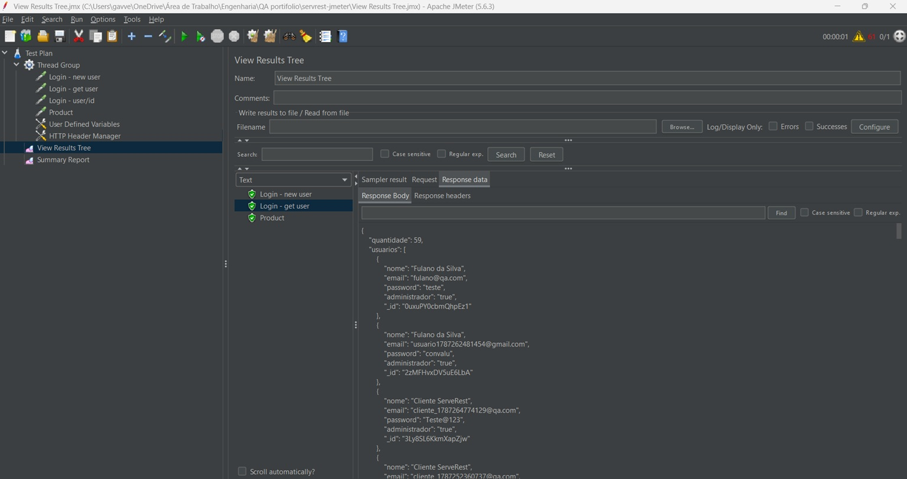
*API response listing registered users, including name, email, password (hash), administrator status, and id.*

---

### Test 3 — List Registered Products

**Method:** `GET`
**Endpoint:** `https://serverest.dev/produtos`

**Description:**
Request to check the products registered in the API, following the official ServeRest documentation.

**Result:**
Status code **200 (OK)**, with a total of **256 registered products** successfully returned.

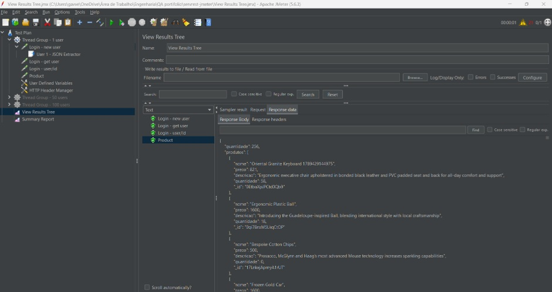
*API response listing registered products, with name, price, description, quantity, and id for each item.*

---

### Test 4 — Get User by ID

**Method:** `GET`
**Endpoint:** `https://serverest.dev/usuarios/${USER_ID}`

**Description:**
This test reuses the `USER_ID` variable captured automatically by the JSON Extractor right after Test 1 runs, fetching that specific user by its ID — validating that the API correctly returns a single resource instead of the full collection. Because the ID is captured per-thread and per-iteration, this works correctly even when 50 or 100 threads are creating and looking up their own users at the same time.

**Result:**
Status code **200 (OK)**, with the specific user's data (name, email, password hash, administrator flag, and `_id`) returned correctly, matching the user just created in Test 1.

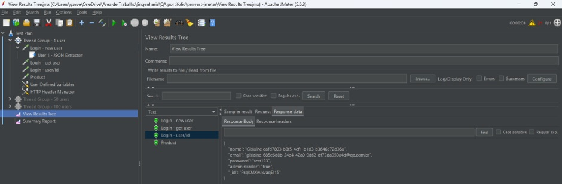
*Successful response (200 OK) returning the specific user's data by ID, captured dynamically via the JSON Extractor.*

---

## 📊 Overall Results

| Test | Method | Endpoint | Expected Status | Actual Status |
|---|---|---|---|---|
| Create user | POST | `/usuarios` | 201 | ✅ 201 |
| List users | GET | `/usuarios` | 200 | ✅ 200 |
| List products | GET | `/produtos` | 200 | ✅ 200 |
| Get user by ID | GET | `/usuarios/${USER_ID}` | 200 | ✅ 200 |

All functional tests behaved as expected, validating the four endpoints under a single-user baseline before moving on to the concurrent load scenarios below.

---

## 📈 Performance Metrics — 1 vs. 50 vs. 100 Users

The same test plan was executed three times with different Thread Group configurations, each one enabled on its own (the other two disabled) and with the Summary Report cleared beforehand, so every scenario's numbers are isolated.

### Scenario A — 1 User

**Thread Group configuration:** 1 thread (user), 1-second ramp-up, loop count 1.

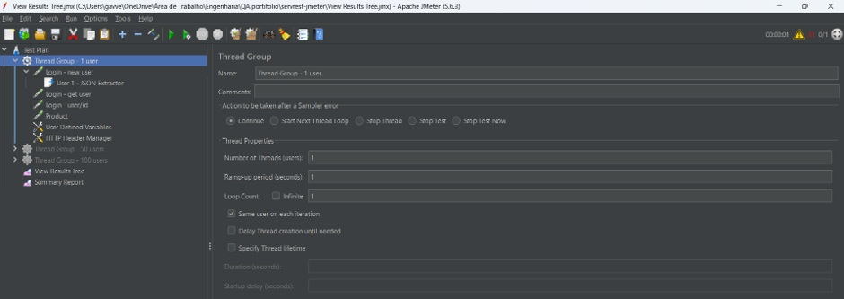
*Thread Group set to simulate a single user, with a 1-second ramp-up and a single loop.*

**Summary Report results:**

| Label | # Samples | Average | Min | Max | Std. Dev. | Error % | Throughput |
|---|---|---|---|---|---|---|---|
| Login - new user | 5 | 253 ms | 233 ms | 266 ms | 13.96 | 0.00% | 5.0/hour |
| Login - get user | 5 | 223 ms | 190 ms | 269 ms | 33.81 | 0.00% | 5.0/hour |
| Product | 5 | 257 ms | 210 ms | 293 ms | 28.33 | 0.00% | 5.0/hour |
| Login - user/id | 4 | 117 ms | 0 ms | 163 ms | 66.12 | 50.00% | 6.1/hour |
| **TOTAL** | **19** | **216 ms** | **0 ms** | **293 ms** | **66.41** | **21.05%** | **18.0/hour** |

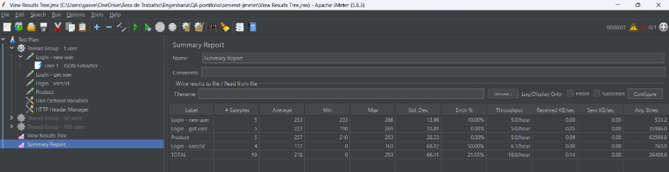
*Summary Report consolidating the results of all requests executed during the 1-user scenario.*

**Reading these numbers:**
- **Login - new user**, **Login - get user**, and **Product** all show **0% errors**, with response times comfortably under 300 ms — stable, predictable performance under a single-user load.
- **Login - user/id** shows a 50% error rate on a small sample (4 requests, 2 failures, with a 0 ms minimum pointing to a failed/near-instant connection rather than a slow response). Given the small sample size, this looks like an isolated blip rather than a systemic issue — the 50-user run below shows the same request with 0% errors across 50 samples.

### Scenario B — 50 Users

**Thread Group configuration:** 50 threads (users), 5-second ramp-up, loop count 1.

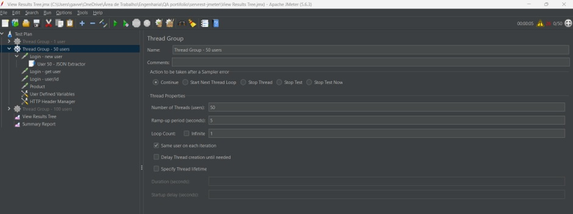
*Thread Group set to simulate 50 concurrent users, with a 5-second ramp-up.*

**Summary Report results:**

| Label | # Samples | Average | Min | Max | Std. Dev. | Error % | Throughput |
|---|---|---|---|---|---|---|---|
| Login - new user | 50 | 266 ms | 222 ms | 451 ms | 43.36 | 0.00% | 9.6/sec |
| Login - get user | 50 | 210 ms | 179 ms | 263 ms | 20.13 | 0.00% | 9.7/sec |
| Login - user/id | 50 | 163 ms | 0 ms | 283 ms | 19.49 | 0.00% | 9.5/sec |
| Product | 50 | 307 ms | 268 ms | 453 ms | 32.80 | 0.00% | 9.5/sec |
| **TOTAL** | **200** | **237 ms** | **0 ms** | **451 ms** | **62.66** | **0.00%** | **34.0/sec** |

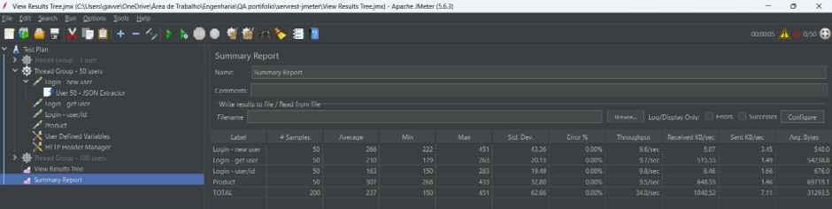
*Summary Report consolidating the results of all requests executed during the 50-user scenario.*

**Reading these numbers:**
- **Every single endpoint returned 0% errors** across all 200 samples.
- Response times stayed close to the 1-user baseline (roughly 160–310 ms average), with only a modest increase, showing the API comfortably handles 50 concurrent connections.
- This scenario represents the healthiest result of the three: full reliability with only a mild performance cost.

### Scenario C — 100 Users

**Thread Group configuration:** 100 threads (users), 10-second ramp-up, loop count 1.

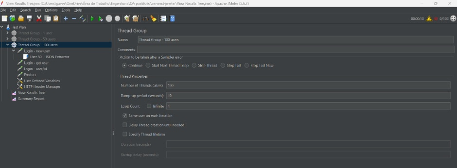
*Thread Group set to simulate 100 concurrent users, with a 10-second ramp-up.*

**Summary Report results:**

| Label | # Samples | Average | Min | Max | Std. Dev. | Error % | Throughput |
|---|---|---|---|---|---|---|---|
| Login - new user | 100 | 245 ms | 219 ms | 345 ms | 33.33 | 22.00% | 9.9/sec |
| Login - get user | 100 | 286 ms | 148 ms | 664 ms | 87.10 | 23.00% | 9.9/sec |
| Login - user/id | 100 | 167 ms | 0 ms | 687 ms | 53.44 | 26.00% | 10.1/sec |
| Product | 100 | 267 ms | 150 ms | 805 ms | 86.13 | 29.00% | 10.1/sec |
| **TOTAL** | **400** | **241 ms** | **0 ms** | **805 ms** | **82.34** | **25.00%** | **37.7/sec** |

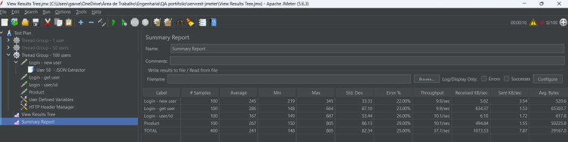
*Summary Report consolidating the results of all requests executed during the 100-user scenario.*

**Reading these numbers:**
- **Every endpoint shows a substantial error rate (22%–29%)** — including the two read-only endpoints ("Login - get user" and "Product"), which had been completely error-free in the 1 and 50-user scenarios.
- Average response times did not spike dramatically (all four requests stayed under 300 ms on average, with maxes topping out around 664–805 ms) — a different pattern from latency-driven failures, where slow responses cause timeouts.
- Because errors appear broadly across read and write endpoints alike, and average latency stayed relatively contained, this looks less like "the server is just slow" and more like the public ServeRest API applying some form of **connection throttling or rate limiting** once concurrency crosses a certain threshold — rejecting a portion of requests outright rather than queuing and answering them slowly.

### Side-by-Side Comparison — 1 vs. 50 vs. 100 Users

| Request | Avg (1 user) | Avg (50 users) | Avg (100 users) | Error % (1 user) | Error % (50 users) | Error % (100 users) |
|---|---|---|---|---|---|---|
| Login - new user | 253 ms | 266 ms | 245 ms | 0.00% | 0.00% | 22.00% |
| Login - get user | 223 ms | 210 ms | 286 ms | 0.00% | 0.00% | 23.00% |
| Login - user/id | 117 ms | 163 ms | 167 ms | 50.00%* | 0.00% | 26.00% |
| Product | 257 ms | 307 ms | 267 ms | 0.00% | 0.00% | 29.00% |

*\*Small sample (4 requests) at 1 user; treated as an isolated anomaly rather than a systemic result — see Scenario A notes above.*

**What this shows:**

- **50 concurrent users is comfortably within the public API's capacity** — 0% errors across all 200 samples in that scenario, with only a mild increase in response times over the 1-user baseline.
- **100 concurrent users is where the API starts to break down.** Errors appear broadly (all four endpoints, 22–29%), but are **not** accompanied by extreme latency — pointing more toward rate-limiting/connection rejection than server overload from slow processing.
- Taken together, the results suggest the public ServeRest API's practical concurrency ceiling — for this test plan and network conditions — sits somewhere between 50 and 100 simultaneous users, and that the API responds to overload less by slowing down and more by rejecting a portion of requests outright.

### Conclusion

This comparison highlights a key concept in performance testing: response time and error rate under load rarely scale linearly with the number of users. The API is fully reliable at 1 and 50 concurrent users, and only starts failing at 100 — and it fails in a specific way, with broad but shallow errors (roughly a quarter of requests across every endpoint) rather than a few endpoints slowing to a crawl. This kind of pattern — errors without matching latency spikes — is a useful signal that points toward rate-limiting or connection-level rejection as the likely cause, rather than the server simply struggling to process requests fast enough.

---

## 📌 Notes

- Images are organized in the `Images/` subfolder — keep this structure when uploading the project to GitHub (README.md at the root and the `Images/` folder alongside it) so they display correctly.
- The `.jmx` test plan can be attached to the repository so the full flow (all 4 requests + variables + JSON Extractor, across all three Thread Groups) is reproducible by anyone reviewing the project.
- Each scenario (1, 50, 100 users) was run with only its own Thread Group enabled and the Summary Report cleared beforehand (`Run → Clear All Results`), which is why the sample counts line up exactly with the number of threads in each scenario.
- Future improvements: investigate the isolated "Login - user/id" error at 1 user with a dedicated re-run; for the 100-user scenario, capture response codes/headers on the failed samples (via View Results Tree or a listener writing to a `.jtl` file) to confirm whether the failures are HTTP 429/5xx responses or connection-level rejections, which would confirm the rate-limiting hypothesis.

## 🔗 References

- [ServeRest API Documentation](https://serverest.dev/)
- [Apache JMeter](https://jmeter.apache.org/)
