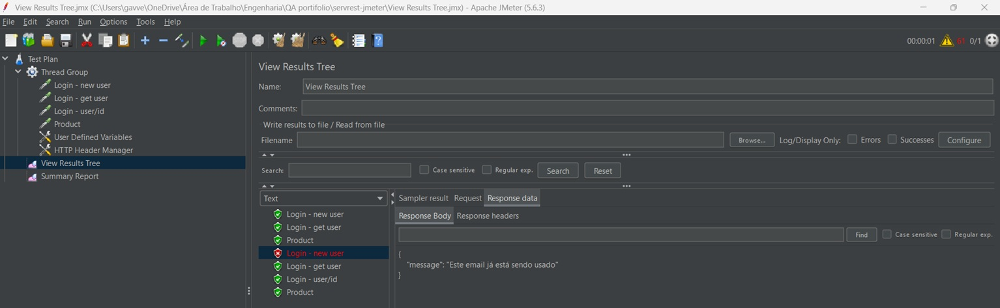
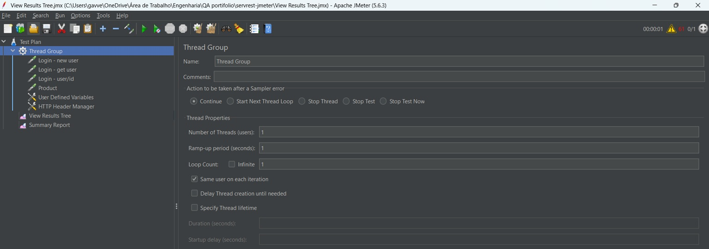
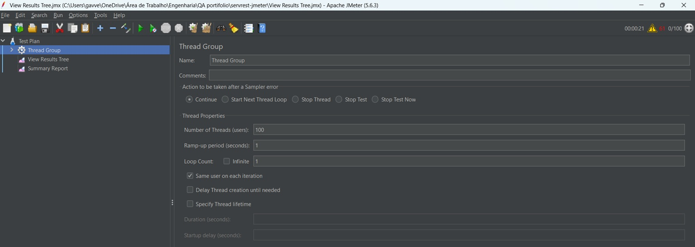

# API Testing with JMeter — ServeRest

Automated API test project built with **Apache JMeter**, using the open source public API **[ServeRest](https://serverest.dev/)** as the target. The goal of this project is to build a functional test plan with multiple requests, validate REST API behavior, and analyze performance metrics under different load conditions (1 user vs. 100 concurrent users).

Automated API test project built with **Apache JMeter**, using the open source public API **[ServeRest](https://serverest.dev/)** as the target. The goal of this project is to build a functional test plan with multiple requests, validate REST API behavior, and analyze performance metrics under different load conditions (1 user vs. 100 concurrent users).

## 🎯 Objective

Validate the behavior of REST API endpoints (user creation, user listing, user lookup by ID, and product listing), checking HTTP status codes, response times, and response integrity — and compare how the API performs under a single user versus 100 concurrent users.

## 🛠️ Tools Used

- **Apache JMeter** — performance testing and request automation tool
- **ServeRest API** — public API for testing practice (`https://serverest.dev`)
- **JSON** — format used in the request bodies

## 🧩 Test Plan Structure

The test plan was built using the following JMeter elements:

### Thread Group
The starting element of the plan, responsible for defining the number of users (threads) that run the test, the ramp-up time, and the number of loops. This project reuses the same Thread Group to run two scenarios: **1 user** and **100 users**, so results could be compared side by side.

### HTTP Requests
Four separate HTTP Request samplers were added to the Thread Group, each targeting a different endpoint of the ServeRest API:

| Sampler Name | Method | Endpoint |
|---|---|---|
| **Login - new user** | POST | `https://serverest.dev/usuarios` |
| **Login - get user** | GET | `https://serverest.dev/usuarios` |
| **Login - user/id** | GET | `https://serverest.dev/usuarios/${USER_ID}` |
| **Product** | GET | `https://serverest.dev/produtos` |

Keeping all requests inside the same test plan (instead of overwriting a single HTTP Request each time) allows the whole flow to run together and produces a single, consolidated Summary Report.

### HTTP Header Manager
Used to manage request headers, ensuring the `Content-Type` and other headers were correctly set for sending JSON data.

### User Defined Variables
Reusable variables were defined throughout the test plan, such as:
- `username`
- `email`
- `password`
- `administrator`
- `USER_ID` — captured after the user creation request and reused in the "Login - user/id" request

This approach avoids repeating fixed data and makes the test plan easier to maintain.

### View Results Tree
Component used to visualize the detailed result of each request (request/response), including status code, response body, and headers.

### Summary Report
Provides a consolidated view of request performance, including average response time, throughput, and error rate for the tested API — used here to compare the 1-user and 100-user scenarios.

---

## ✅ Test Cases

### Test 1 — Create User

**Method:** `POST`
**Endpoint:** `https://serverest.dev/usuarios`

**Description:**
Request to register a new user, sending a JSON body with the data required by the API (name, email, password, and administrator).

**Steps performed:**
1. Configured the endpoint and POST method in the HTTP Request, with the body data in JSON.
2. Sent the request and checked the Request Body that was submitted.
3. Ran the test and reviewed the result in the View Results Tree tab.

**Result:**
Request executed successfully — status code **201 (Created)**, with the message `"Cadastro realizado com sucesso"` (registration successful) returned by the API, along with the new user's `_id`.

*HTTP Request configuration: POST method, endpoint `https://serverest.dev/usuarios`, and JSON body data.*

*Sampler result showing response code 201 and message "Created", along with load time and byte size details.*

*Detail of the request body sent in JSON format, with name, email, password, and administrator fields.*

*API response confirming the user registration with the success message and the returned `_id`.*

> After registration, a new variable (`USER_ID`) was created to store the `_id` of the user returned by the API, allowing it to be reused in the "Login - user/id" request.

---

### Test 2 — List Registered Users

**Method:** `GET`
**Endpoint:** `https://serverest.dev/usuarios`

**Description:**
A simple request, containing only the endpoint address, used to check all users currently registered in the API.

**Result:**
Status code **200 (OK)**, with a total of **59 registered users** returned in the response body.

*API response listing registered users, including name, email, password (hash), administrator status, and id.*

---

### Test 3 — List Registered Products

**Method:** `GET`
**Endpoint:** `https://serverest.dev/produtos`

**Description:**
Request to check the products registered in the API, following the official ServeRest documentation.

**Result:**
Status code **200 (OK)**, with a total of **170 registered products** successfully returned.

*API response listing registered products, with name, price, description, quantity, and id for each item.*

---

### Test 4 — Get User by ID

**Method:** `GET`
**Endpoint:** `https://serverest.dev/usuarios/${USER_ID}`

**Description:**
After creating the user in Test 1, this test reuses the captured `USER_ID` variable to fetch that specific user by its ID — validating that the API correctly returns a single resource instead of the full collection.

Along the way, re-running the "Login - new user" request with the same email produced an expected negative-path result: since the email was already registered, the API correctly rejected the duplicate with an error message, confirming its validation rules are working as intended.

**Result:**
- Duplicate registration attempt → API correctly returned an error message stating the email was already in use.
- Get user by ID → status code **200 (OK)**, with the specific user's data returned correctly.

*"Login - user/id" request configuration, using the `${USER_ID}` variable captured from the user creation step.*

*API response when attempting to register a user with an email that is already in use — validates the API's duplicate-check logic.*

*Successful response (200 OK) returning the specific user's data by ID.*

---

## 📊 Overall Results

| Test | Method | Endpoint | Expected Status | Actual Status |
|---|---|---|---|---|
| Create user | POST | `/usuarios` | 201 | ✅ 201 |
| List users | GET | `/usuarios` | 200 | ✅ 200 |
| List products | GET | `/produtos` | 200 | ✅ 200 |
| Get user by ID | GET | `/usuarios/${USER_ID}` | 200 | ✅ 200 |
| Duplicate registration | POST | `/usuarios` | 400 (expected error) | ✅ Error returned as expected |

All tests behaved as expected, validating both the "happy path" endpoints and a negative-path scenario (duplicate email), confirming the API's business rules are enforced correctly.

---

## 📈 Performance Metrics — 1 User vs. 100 Users

To go beyond functional validation, the same test plan was executed twice with different Thread Group configurations, to observe how the API responds under different load conditions.

### Scenario A — 1 User

**Thread Group configuration:** 1 thread (user), 1-second ramp-up, loop count 1.

*Thread Group set to simulate a single user, with a 1-second ramp-up and a single loop.*

**Summary Report results:**

| Label | # Samples | Average | Min | Max | Std. Dev. | Error % | Throughput | Received KB/sec | Sent KB/sec | Avg. Bytes |
|---|---|---|---|---|---|---|---|---|---|---|
| Login - new user | 7 | 350 ms | 279 ms | 456 ms | 57.04 | 57.14% | 23.0/hour | 0.00 | 0.00 | 529.1 |
| Login - get user | 7 | 215 ms | 189 ms | 286 ms | 30.65 | 0.00% | 23.0/hour | 0.09 | 0.00 | 13637.4 |
| Product | 7 | 211 ms | 202 ms | 223 ms | 6.58 | 0.00% | 23.0/hour | 0.23 | 0.00 | 37421.4 |
| Login - user by id | 3 | 3 ms | 2 ms | 6 ms | 1.70 | 100.00% | 1.3/min | 0.06 | 0.00 | 2631.0 |
| Login - user/id | 1 | 205 ms | 205 ms | 205 ms | 0.00 | 0.00% | 4.9/sec | 2.87 | 0.83 | 603.0 |
| **TOTAL** | **27** | **238 ms** | **2 ms** | **456 ms** | **111.66** | **25.93%** | **25.8/hour** | **0.11** | **0.00** | **16245.3** |

*Summary Report consolidating the results of all requests executed during the 1-user scenario.*

**Reading these numbers:**
- The **Summary Report accumulates results across every execution in the session** (it isn't automatically cleared between runs), which is why sample counts differ per request (7 vs. 3 vs. 1) — some requests were manually re-run multiple times while the test plan was being configured and the `USER_ID` variable was being set up correctly.
- The **57.14% error rate on "Login - new user"** isn't a bug: most of those samples were intentional repeat attempts using an already-registered email (see Test 4), which correctly returned an error — this is expected negative-path behavior, not an API failure.
- The **100% error rate on "Login - user by id"** reflects early attempts made *before* the `USER_ID` variable was correctly captured and wired into the request — once fixed, the renamed "Login - user/id" sampler succeeded with 0% errors.
- Excluding those known/expected error sources, the "happy path" requests (**Login - get user** and **Product**) show **0% errors**, low standard deviation, and response times consistently under 300ms — indicating stable, predictable performance under a single-user load.

### Scenario B — 100 Users

**Thread Group configuration:** 100 threads (users), 1-second ramp-up, loop count 1 — meaning all 100 virtual users were launched almost simultaneously.

*Thread Group set to simulate 100 concurrent users, with a 1-second ramp-up.*

**Summary Report results:**

| Label | # Samples | Average | Min | Max | Std. Dev. | Error % | Throughput | Received KB/sec | Sent KB/sec | Avg. Bytes |
|---|---|---|---|---|---|---|---|---|---|---|
| Login - new user | 107 | 7598 ms | 256 ms | 19467 ms | 8924.60 | 58.88% | 3.4/min | 0.03 | 0.02 | 525.5 |
| Login - get user | 107 | 344 ms | 186 ms | 738 ms | 142.61 | 0.00% | 3.4/min | 0.73 | 0.01 | 13071.8 |
| Product | 107 | 460 ms | 202 ms | 795 ms | 173.62 | 0.00% | 3.4/min | 1.30 | 0.01 | 23203.3 |
| Login - user by id | 3 | 3 ms | 2 ms | 6 ms | 1.70 | 100.00% | 1.3/min | 0.06 | 0.00 | 2631.0 |
| Login - user/id | 101 | 655 ms | 166 ms | 16467 ms | 1599.76 | 41.58% | 7.9/min | 0.07 | 0.02 | 563.1 |
| **TOTAL** | **427** | **2262 ms** | **2 ms** | **19467 ms** | **5487.37** | **25.29%** | **5.6/min** | **0.88** | **0.02** | **9535.0** |

*Summary Report consolidating the results of all requests after running the plan with 100 concurrent users.*

> Note: sample counts here are cumulative (they include the previous 1-user run's samples plus the new 100-user execution), for the same reason explained in Scenario A — the report wasn't cleared between runs.

### Side-by-Side Comparison — 1 User vs. 100 Users

| Request | Avg (1 user) | Avg (100 users) | Max (1 user) | Max (100 users) | Error % (1 user) | Error % (100 users) |
|---|---|---|---|---|---|---|
| Login - get user | 215 ms | 344 ms | 286 ms | 738 ms | 0.00% | 0.00% |
| Product | 211 ms | 460 ms | 223 ms | 795 ms | 0.00% | 0.00% |
| Login - new user | 350 ms | 7598 ms | 456 ms | 19467 ms | 57.14% | 58.88% |
| Login - user/id | 205 ms | 655 ms | 205 ms | 16467 ms | 0.00% | 41.58% |

**What this shows:**

- **Read-only endpoints held up well.** "Login - get user" and "Product" stayed at **0% errors** in both scenarios. Their average response time did increase under load (+60% and +118% respectively), which is expected — the server has to handle 100x the concurrent read requests — but there were no failures, indicating the API's read endpoints are reasonably resilient to concurrent traffic.
- **Write/lookup endpoints degraded sharply.** "Login - new user" went from an already-elevated 350ms average (due to duplicate-email attempts) to a dramatic **7598ms average, with a peak of nearly 19.5 seconds**. "Login - user/id" jumped from 205ms to 655ms average, with peaks over 16 seconds and a 41.58% error rate — under 1 user it had 0% errors.
- **Root cause is twofold:** part of the errors come from the test design itself (the same fixed user data was reused across all 100 threads, so most "create user" calls were expected duplicates — a known limitation explained further below), while the sharp latency increase (multi-second response times, especially the ~19s max) points to the **public ServeRest API struggling to handle 100 simultaneous connections**, since it's a free, shared testing service and not built for high concurrency.

### Conclusion

This comparison highlights a key concept in performance testing: **response time and error rate under load rarely scale linearly with the number of users.** With a single user, all four endpoints behaved fast and predictably. At 100 concurrent users, read-only endpoints slowed down moderately but stayed reliable, while endpoints involving data writes and dynamic parameters became significantly slower and less reliable — some responses took nearly 20 seconds, well beyond what would be acceptable in a production scenario.

It's also worth noting a limitation of this specific test setup: because the same hard-coded user data (name, email, password) was used across all 100 threads, most "create user" attempts were duplicates by design, inflating the error count for that request. In a more rigorous load test, each thread would generate **unique test data** (e.g., using JMeter's `${__Random}` or CSV Data Set Config) so that "create user" failures reflect genuine server-side issues rather than expected validation errors.

Overall, this exercise was a valuable first hands-on experience with JMeter — going from a single functional check to a real concurrency comparison, and learning to read metrics like Average, Std. Dev., Error %, and Throughput in context, rather than at face value. It also surfaced practical lessons for future test design: resetting the Summary Report between runs, and using dynamic/unique test data when simulating multiple concurrent users.

---

## 📌 Notes

- Images are organized in the `Images/` subfolder — keep this structure when uploading the project to GitHub (README.md at the root and the `Images/` folder alongside it) so they display correctly.
- The `.jmx` test plan can be attached to the repository so the full flow (all 4 requests + variables) is reproducible by anyone reviewing the project.
- Future improvements: reset the Summary Report (**Run → Clear All**) before each measured scenario, and use dynamic/unique test data per thread (e.g. `${__Random}` or CSV Data Set Config) to get cleaner, more isolated metrics in future load tests.

## 🔗 References

- [ServeRest API Documentation](https://serverest.dev/)
- [Apache JMeter](https://jmeter.apache.org/)
